Preet Patel
Course: CSE 510 Computer Design
08-19-2024, 2:58 PM
Lecture 1: 1.2 Digital Circuit Design
#computerdesign
[[Computer Science]]

## Part A: Overview of Digital Circuit Design
#### Definitions and Acronyms
- PCB: Printed Circuit Board
- ASIC: Application Specific Integrated Circuit
- VHDL: VHSIC Hardware Description Language
- VHSIC: Very High-Speed Integrated Circuit
- PLD: Programmable Logic Device
- CPLD: Complex Programmable Logic Device
- **FPGA**: Field Programmable Gate Array
- RTL: Register Transfer Level
- IC: Integrated Circuit
- VLSI: Very Large Scale Integration

#### Hardware Description Languages and Methods
- VHDL: primarily used by FPGA designers
- Verilog: primarily used for custom designs, standard cell designs, and gate arrays
	- these are the 4 custom ASIC methods
- System C: not very used
<u>Methods:</u>
1. Behavioral
2. Data Flow
3. Structural
4. Boolean (NAND, XOR, etc.)

<u>Question</u>: *"If a company asks you to create a PCD with a custom hardware solutions, how many choices do you have?"*
1. COTS - "Commercial off the shelf", sometimes preferred because of ease to implement
Custom ASIC Methods:
	2. Full custom
	3. standard cell
	4. gate array
	5. FPGA
6. Microcontroller - Arduino, Raspberry Pi,; contains CPU, ROM, RAM, I/O
7. Microprocessor - Contains CPU
8. Digital Signal Processor
<u>Answer</u>: *You have 8 different options for a custom hardware solution.*

#### $\mu$C (Microcontroller) vs DSP vs FPGA Selection
- Tesla changed from using NVIDIA GPUs to implementing a custom ASIC design for the self-driving cameras and saw a 21X increase (from 110 to 2300 FPS)!
- The chip cost also reduced by 20%
- Overall, the GPU was a COTS device and was easy to implement but the custom ASIC design is much more powerful and cost effective, which makes it the more efficient choice

#### Top Technologies from 2000 to 2010
- Smartphones
- Social Networking
- VOIP - "Voice over internet protocol"
- LED Lighting
- Multicore CPU's
- Cloud Computing
- Drone aircraft
- Planetary rovers
- Smart grid - Flexible AC transmission, helps prevent blackouts
- Digital Photography
- Class-D Audio
Most, if not all, of these technologies include digital ASIC 

----------------
## Part B: Digital IC Content in a Cellphone
- 8 digital ICs in a 2004 Motorola cell phone
#### iPhone Costs and Terminology
- COGS - "Cost of Goods Sold"
- Gross Profit = Sales price - COGS
- Net profit = gross profit - overhead (rent, utilities, salaries, etc.)
- 2007 iPhone cost = $599
- Gross profit on iPhone = Sales - COGS $\Rightarrow$ $599 - $266 = $333 
- in the first weekend, Apple sold 500k phones:
	500,000 * $333 = **$167,000,000** net profit
#### Timing and Clock Generators
- Multiple clocks of various frequencies that are *phase locked* are required for most large digital ASICs
- Can contain both analog and digital circuits
- Can be stand-alone ICs or integrated onto the ASIC
	- PLL: Phase-locked loop, Analog and Digital
	- DLL: Delay-locked loop, all Digital
Schematic of typical PLL:

```mermaid.js
graph LR;
    idInput[Input] --> idPhase[∅ Phase Detector]
    idPhase --> idFilter[Analog Loop Filter]
    idFilter --> idVoltage(Voltage Control Oscillator)
    idVoltage --> idOut[Out]
    idVoltage --> idFreq[Frequency Divider]
    idFreq --> idPhase
```

![[Pasted image 20240819160223.png]]
This is a typical signal
- $i(t)$ is the input signal
- $e(t)$ is the error signal which is modeled by the difference in input and output signals
- the goal is to minimize the error signal
![[Pasted image 20240819160347.png]]
This is a phase locked signal
- The error signal has been completely minimized because both the input and output in phase
#### Xbox 360
contains 4 Custom Digital ICs
- Chipidea video IC
- SiST I/O IC
- ATI Graphics $\mu$P (microprocessor)
- IBM CPU
